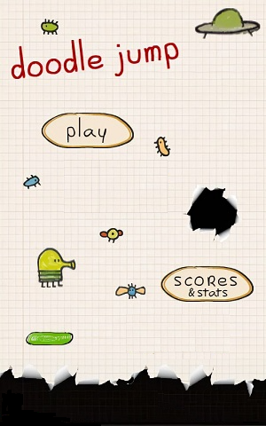
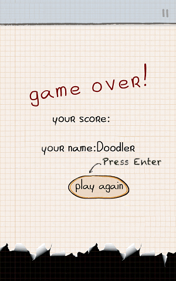
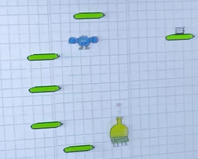
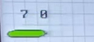
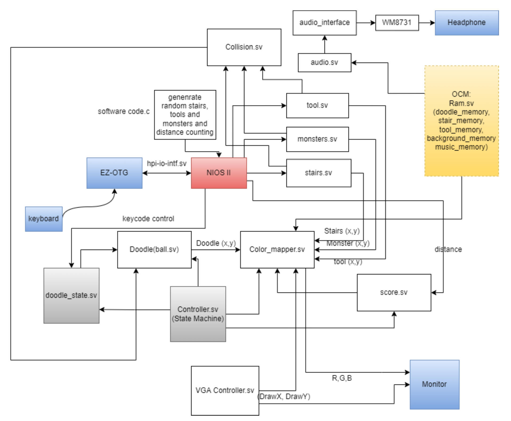
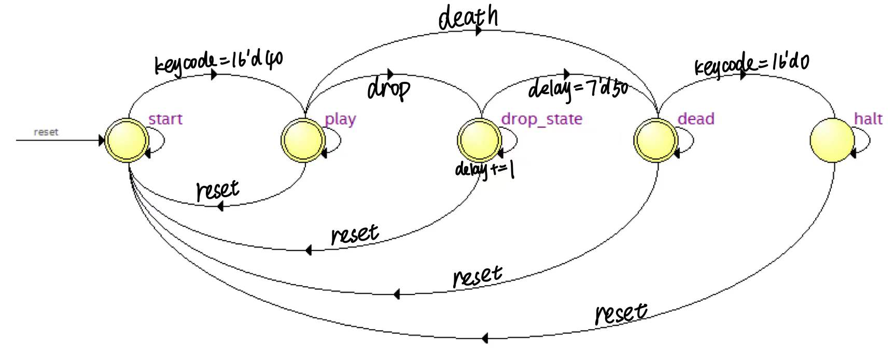

# FPGA-Based Implementation of Doodle Jump

## Course & Institution
Final project for ECE 385 at UIUC ECE Department.

## Authors
- Yuhao Ge
- Haina Lou

## Technical Specifications
- **Platform**: Quartus Prime 18.1 Lite Edition
- **FPGA Board**: DE2-115

## Demo
- [Video Demo](https://www.bilibili.com/video/BV1AS4y1T7gG/)


---

## Overview
This project replicates the game [Doodle Jump](https://en.wikipedia.org/wiki/Doodle_Jump) on a DE2-115 board. The game features a character, "The Doodler," navigating through platforms while avoiding obstacles and monsters. Controls are mapped to keys "A" and "D" for lateral movement and "← ↑ →" for shooting.

---

## Features

### Background
- 320x480 pixel image
- Seamless transition from left to right edge

### Start & End Frames
- 300x480 pixel displays
- Triggered by "Enter" key




### Doodler
- Controlled by "A" and "D"
- Dynamic appearance based on actions

<figure>


<figcaption>Go right</figcaption>
</figure>

### Platforms
- 14 initial platforms
- Dynamic generation as game progresses


### Tools & Monsters
- Randomly generated
- Interact with the Doodler


### Bullets & Score
- Controlled by "← ↑ →"
- Displayed on the upper left corner




### Sound
- Looping background music

---

## Architecture

### Block Diagram


### General Flow
- Hardware-centric design
- NIOS-II for random number generation and I/O
- VGA controller for display output

---

## State Machine


---

## Design Statistics
```
LUT: 17845
DSP: 0
Memory(BRAM): 3188736 bits
Flip-Flop: 3086
Frequency: 14.82MHz
Power: 532.34mW
```

---

## Known Bugs
1. Doodler stuck at boundaries.
2. Sudden appearance of springs and moving platforms.
3. Overlapping stair graphics.
4. Score display errors beyond 99.

---

## Conclusion
The project received the "Best Design Award" for the course. Additional videos detailing the game can be found [here](https://www.bilibili.com/video/BV1AS4y1T7gG?spm_id_from=333.999.0.0) and [here](https://www.bilibili.com/video/BV1yS4y1K78C?from=search&seid=3990977337941430095&spm_id_from=333.337.0.0).
